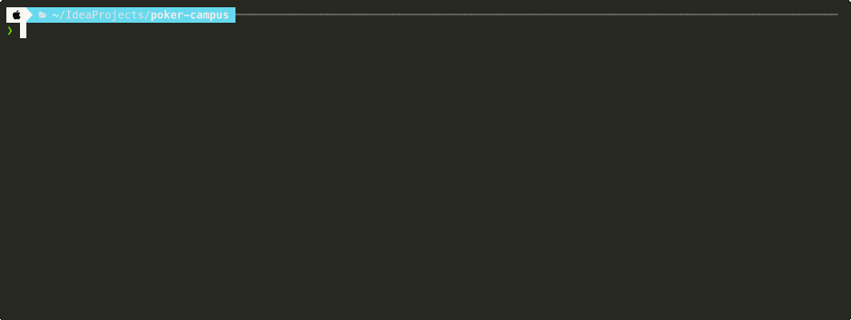

# 🃏 포커 캠퍼스

Java로 구현한 5장 포커 게임

## 데모
[](https://asciinema.xiyo.dev/a/18)

## 게임 방식
- 고정 4명의 플레이어가 100판 진행
- 공식 포커 룰 적용
- 티어 → 구성 숫자 → 키커 순으로 승부 결정

## 실행 방법
```bash
# 컴파일 (out 디렉토리로 출력)
javac -d out poker/src/**/*.java poker/src/*.java

# 실행
java -cp out PokerCampus
```

## 주요 클래스
- `PokerCampus`: 게임 진행 메인 클래스
- `Dealer`: 카드 분배 및 게임 진행
- `Player`: 플레이어 정보 관리
- `Hand`: 패 평가 및 점수 계산
- `Card`: 카드 객체 (Flyweight 패턴)